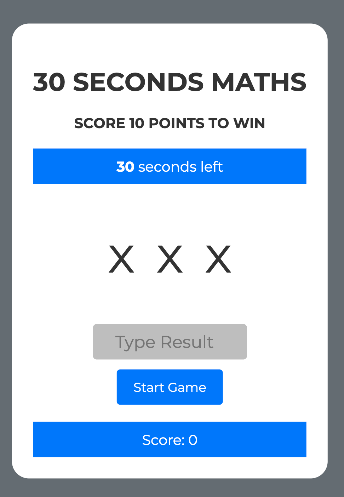

# 30 SECONDS MATHS

## [Click here](https://codewithmaik.github.io/thirty-seconds-maths/) to play 30 SECONDS MATHS

30 SECONDS MATHS is an interactive game to improve your basic math. The game is easy to play and only requires basic math knowledge such as addition and multiplication. The game is a fun way to practice and improve basic math skills. It is suitable for both children and adults and can help boost confidence in mathematics. The game is also a great way to train the brain and improve mental fitness.

This project is a the second portfolio project of the Fullstack Software Development Program of [Code Institute](https://codeinstitute.net/de/). The goal is to build an interactive game using HTML, CSS and JavaScript, the three core technologies of the web.

### FEATURES

The game starts with a start button that prompts the player to start the game. Once the start button is pressed, the game begins and a random mathematical operator (addition or multiplication) is generated, followed by two operands. The player then has to input the result of the mathematical operation and click the "Check" button or press the Enter key to check the result.

For each correct answer, the player gets one point, and for each wrong answer, one point is deducted. The game ends when the player either reaches ten points or the time runs out. If the player reaches ten points, a message is displayed informing them that they have won the game. If the time runs out, the player is informed that they have lost the game.

The design as is clear, user-friendly, and intuitive. The well-structured arrangement of elements and the use of a readable font make it easy for the user to read and understand the information. The color scheme and buttons are designed to be easily recognizable, and the use of animations improves the user's interaction with the application. The application is also responsive to different screen sizes, ensuring that it works well on all devices. Finally, the design is attractive and appealing, providing the user with a pleasant and positive experience.