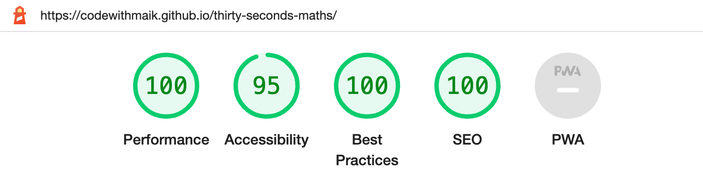

# 30 SECONDS MATHS

## [Click here](https://codewithmaik.github.io/thirty-seconds-maths/) to play 30 SECONDS MATHS

30 SECONDS MATHS is an interactive game to improve your basic math. The game is easy to play and only requires basic math knowledge such as addition and multiplication. The game is a fun way to practice and improve basic math skills. It is suitable for both children and adults and can help boost confidence in mathematics. The game is also a great way to train the brain and improve mental fitness.

This project is a the second portfolio project of the Fullstack Software Development Program of [Code Institute](https://codeinstitute.net/de/). The goal is to build an interactive game using HTML, CSS and JavaScript, the three core technologies of the web.

### FEATURES

The game starts with a start button that prompts the player to start the game. Once the start button is pressed, the game begins and a random mathematical operator (addition or multiplication) is generated, followed by two operands. The player then has to input the result of the mathematical operation and click the "Check" button or press the Enter key to check the result.

For each correct answer, the player gets one point, and for each wrong answer, one point is deducted. The game ends when the player either reaches ten points or the time runs out. If the player reaches ten points, a message is displayed informing them that they have won the game. If the time runs out, the player is informed that they have lost the game.

The design as is clear, user-friendly, and intuitive. The well-structured arrangement of elements and the use of a readable font make it easy for the user to read and understand the information. The color scheme and buttons are designed to be easily recognizable, and the use of animations improves the user's interaction with the application. The application is also responsive to different screen sizes, ensuring that it works well on all devices. Finally, the design is attractive and appealing, providing the user with a pleasant and positive experience.

### Development

- Gitpod was used as the Integrated Development Environment.

- Hypertext Markup Language was used to describe the content of the website.

- Cascading Stylesheets were used to style the content on the website.

- JavaScript was used to add functionality to the game

- The version control software GIT was used during the development process.

### Testing

#### Lighthouse

I tested the website's performance, accessibility, best practices and SEO using lighthouse by chrome developer tools.

#### Code Validation

- I confirm that no errors occured running the HTML code through the Markup Validation Service.

- I confirm that no errors occured running the CSS code through the CSS Validation Service.

- I can confirm that no errors occured running the JavaScript code through the JSLint Service.

#### Browser Compatibilty

I confirm that the website works and looks good in the three main browsers: Google Chrome, Safari, Mozilla Firefox.

#### Responsivness

I can confirm that the website works and looks good on all standard screen sizes using the chrome developer tools. In additon, the websites responsiveness was tested on an IPhone 12 Pro and a MacBook Air.

#### Features

- I confirm that that the "Start Game" button starts the clock and the "Check Answer" button is shown.
- I confirm that after clicking the "Check Answer" button, the score either increases or descreases, depending on the user's solution.
- I confirm that if the time runs out, the user gets a message telling him he lost the game. He also has the option to reset the game using the "Reset" button.
- I confirm that if the user scores 10 points before he runs out of time, he gets a message telling him he won the game. He also has the option to reset the game using the "Reset" button.
- I confirm that the "Reset" button reloads the page and the user can start over again.

### Bugs

#### Fixed Bugs

When implementing the reset button, I had trouble resetting the game to its initial state. Due to time issues, I looked for a quick solution and came across the location.reload() function in JavaScript, which reloads the page and sets the game to its initial state. I found the solution on [MDN Web Docs](https://developer.mozilla.org/en-US/docs/Web/API/Location/reload).

### Contents

- The font was imported using Google Fonts

- The text content was written by myself.

### Deployment

The website was deployed to Github pages. The steps were as followed:

1. Click on the repository of get-your-greens.

2. Click on settings.

3. Click on pages.

4. Choose to deploy from a branch, pick the main branch and save.

5. The link to the site displays on the page.

