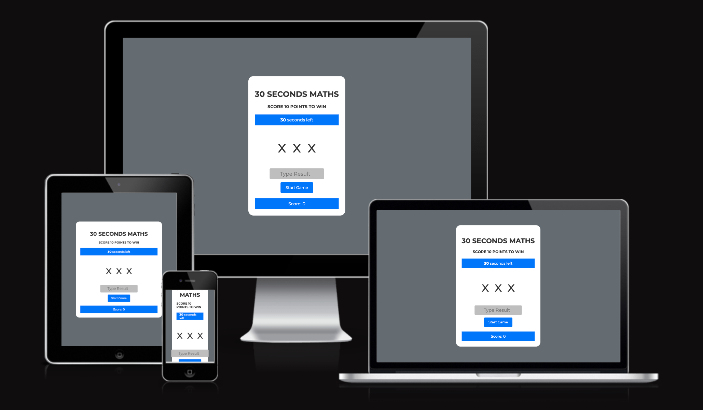

# 30 SECONDS MATHS

## [Click here](https://codewithmaik.github.io/thirty-seconds-maths/) to play 30 SECONDS MATHS

30 SECONDS MATHS is an interactive game to improve your basic math. The game is easy to play and only requires basic math knowledge such as addition and multiplication. The game is a fun way to practice and improve basic math skills. It is suitable for both children and adults and can help boost confidence in mathematics. The game is also a great way to train the brain and improve mental fitness.

This project is a the second portfolio project of the Fullstack Software Development Program of [Code Institute](https://codeinstitute.net/de/). The goal is to build an interactive game using HTML and CSS and JavaScript, the three core technologies of the web.